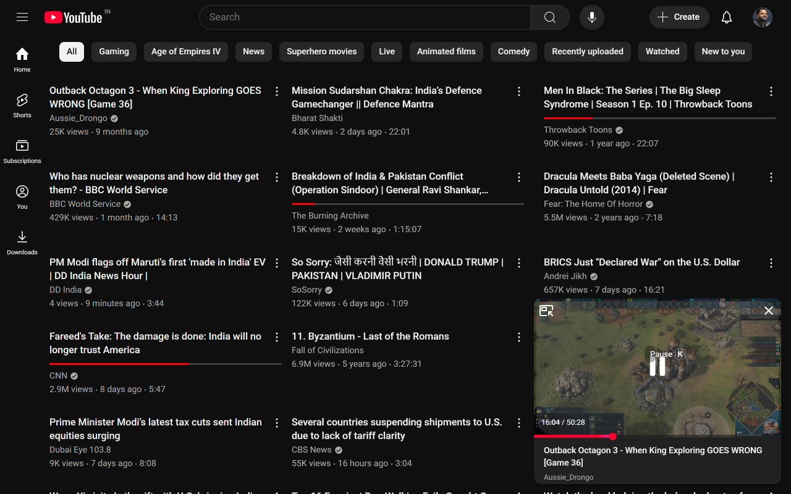

# YouTube for Blog Readers Extension

**No tracking. No bloat. Just a simple, privacy-respecting extension for text-first YouTube browsing.**

## ✨ Features

- **Hide distracting thumbnails** everywhere on YouTube (home, search, channel, playlists, sidebar, recommendations)
- **Show video durations** next to titles, even when thumbnails are hidden
- **Hide channel avatars** (including sidebar/guide avatars) for a cleaner, distraction-free look
- **Show full video titles** (no more truncation)
- **Show watch progress** (optional)
- **Per-page enable/disable**: Enable or disable features on home, search, channel, playlist, watch, subscriptions, and shorts pages
- **Block/whitelist channels**: Hide features for specific channels
- **Modern, minimal, and responsive options page** (with dark mode support)

## 🚀 Why use this extension?

- **No tracking, no analytics, no ads, no nonsense**
- **No background scripts**—runs only on YouTube
- **No data collection**—your settings are stored locally, never sent anywhere
- **Tiny, fast, and open source**
- **Works out of the box**—just install and enjoy a calmer YouTube

## 🛠️ Usage

1. **Install the extension** from the Chrome Web Store or load it as an unpacked extension
2. Click the extension icon to open the options page
3. Toggle features on/off as you like (thumbnails, avatars, durations, etc.)
4. Optionally, enable/disable on specific YouTube pages or block/whitelist channels
5. Enjoy a distraction-free, text-first YouTube experience!

## 🎯 Who is this for?

- Readers who prefer text and metadata over images
- Anyone who wants to avoid clickbait and visual noise
- Minimalists and productivity-focused users
- People who want a blog-like, calm YouTube

## 🛡️ Privacy & Philosophy

This extension does **not** track you, collect any data, or inject ads. All settings are stored locally in your browser. The code is open source and easy to audit. No tricks, no hidden scripts—just a tool for a better YouTube.

---

**Transform YouTube into a blog-like, text-first platform. No tracking. No bluff. Just focus.**